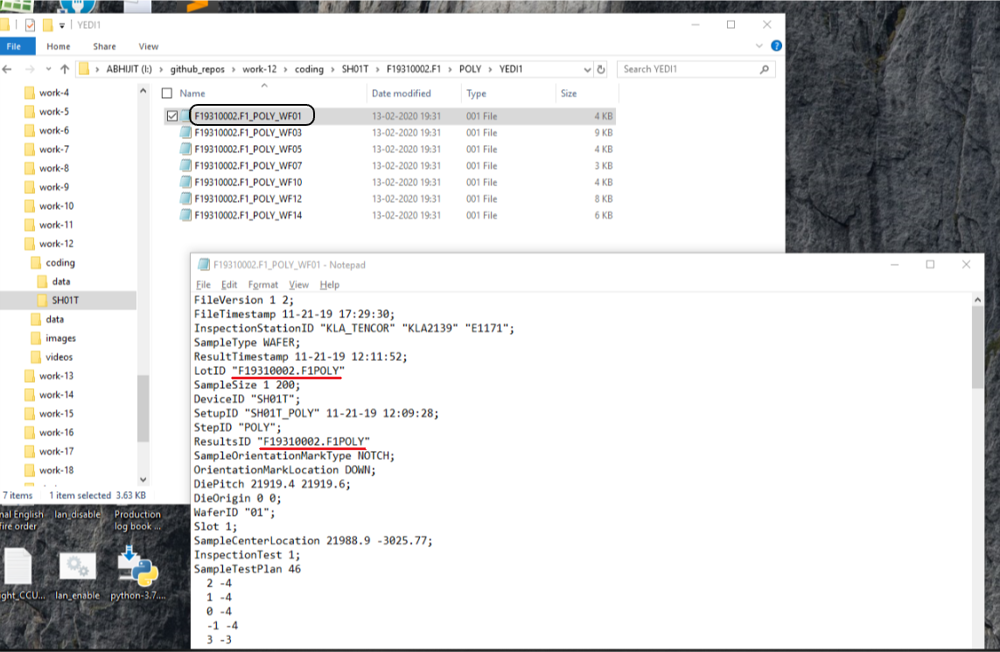

# work-12
Renaming file based on file content at a particular location

## Input
The input task is as follows:

  

* There are multiple files generated from DIA Equipment with filename as random number.
* The following parameters in the input file are to be extracted: 
	- `LotID`
	- `StepID`
	- `ResultsID`
	- `WaferID`
	- `DeviceID`

## Output
The output is as follows:

  

* The random named files will be renamed w.r.t nomenclature as `<lot_id>_<step_id>_<wafer_id>`. E.g: `F19310002.F1_POLY_WF01`
* The modified & renamed files will be moved from src to dest directory i.e. `<device_id>/<step_id>/<lot_id>/YEDI1/`
* Also, the following parameters of the respective file is changed:
	- `LotID`
	- `ResultsID`

## Coding
The pseudo code is as follows:

1. Walk in directory of the input files i.e. source directory.
1. Open the files (in read mode) with __(*.001)__ extension (if available) in the given directory. E.g. `"./data"`
1. Extract the respective parameters information - lineno, values,
1. Modify the params - output_filename, new_deviceid, new_resultsid
1. Write it back inside the file
1. Create the folder(s) with `deviceid`, `lotid`, `stepid`, if doesn't exist.
1. rename & move the files from src to des location. Use this func: `os.rename(src, des)`
	- Use try & except exception handling in order to check if the modified file already exists.

## Testing
* [x] Case-1: simply put the data files into `"./coding/data"`
	- Here, the files should be moved from src to des
* [x] Case-2: put the data files into `"./coding/data"`, but don't delete the new folder, subfolders & the set of moved files
	- Here, run repeatedly to see if there is any subfolder being created inside the "device" folder e.g. 'F19010001.F1POLY', 'F19010001.F1POLYPOLY'
* [x] Case-3: put the data files into `"./coding/data"`, but delete the moved files from dest directory.
	- This moves the modified & renamed file into the destination directory.

## Demo
The demo video is available [here](./videos/work_12_demo.mp4) [to be modified as per `v0.2`]